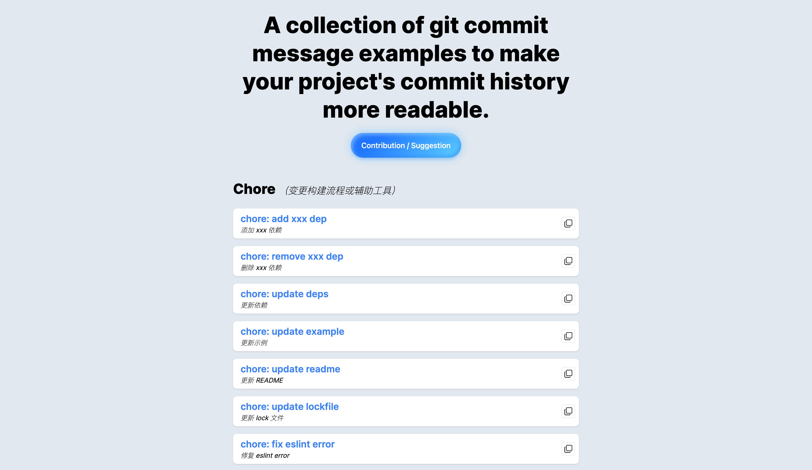
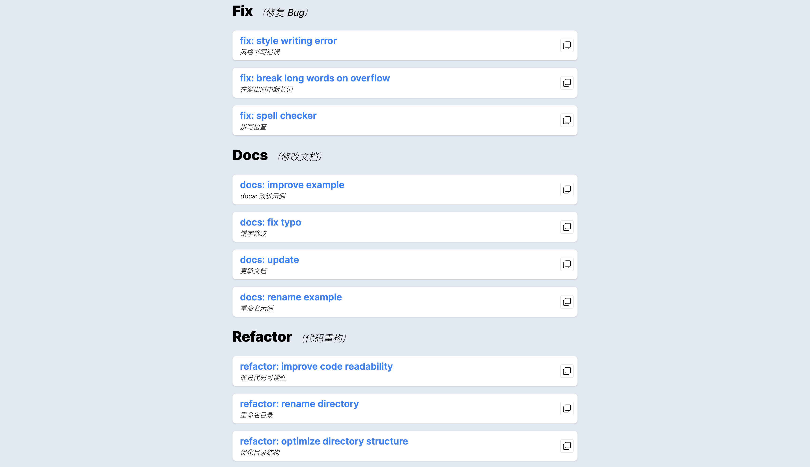

# Awesome Git Commit Messages

[Website](https://git.hongbusi.com)

A collection of git commit message examples to make your project's commit history more readable.




## Want to contribute?

### New pull request (Recommend)

1. Fork [the repository](https://github.com/Hongbusi/awesome-git-commit-messages), and create your branch from `main`.
2. Use `pnpm install` install the dependencies.(execute githooks)
3. Make changes to `src/config.ts`.
4. Commit your changes, and open a new pull request.

### New issue

[To create a new issue](https://github.com/Hongbusi/awesome-git-commit-messages/issues/new)

Need to include the following fields：

- `message`
- `description`

Eg:

``` md
message: chore: add xxx dep
description: 添加 xxx 依赖
```

## License

[MIT](./LICENSE) License © 2022 [Hongbusi](https://github.com/Hongbusi) 
